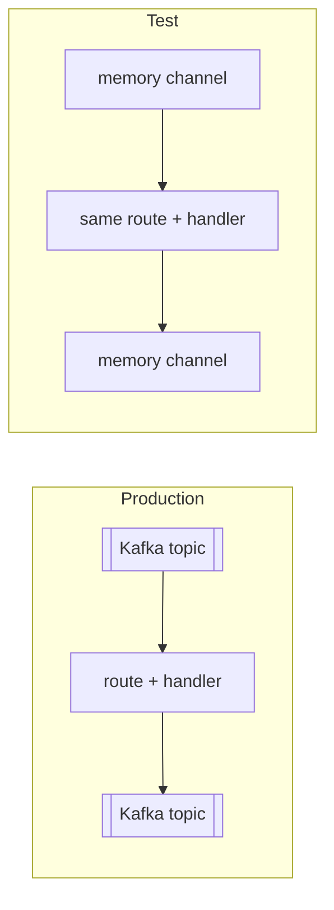

<!-- description: Test Kafka, NATS or RabbitMQ message handlers in Rust and Python without a running broker, Docker or mocks, by swapping the transport for an in-memory endpoint. -->

# How to test Kafka consumers and message handlers without a broker

Build the route from endpoints passed in by the caller: Kafka (or NATS, RabbitMQ, MQTT) in
production, mq-bridge's in-process `memory` endpoint in tests. The handler, the route and the
middleware under test are the production code; only the transport is swapped, so the tests need no
Docker and wait for no broker to start.

Runnable example: [`examples/test-without-a-broker`](https://github.com/marcomq/mq-bridge/tree/main/examples/test-without-a-broker).

## The problem: slow, flaky or shallow tests for messaging code

Code that consumes from a broker is awkward to test:

- **A real broker in every test run** (Docker Compose or Testcontainers) costs seconds to minutes
  of startup, needs Docker on every developer machine and CI runner, and fails for reasons that
  have nothing to do with the change under test.
- **Mocking the client library** tests the mock. Hand-written fakes of a Kafka consumer drift from
  the real API and skip the code between the client and the handler: deserialization, routing by
  message type, acknowledgement.
- **Testing the handler function alone** is fast but leaves that same glue untested.

## The solution: make the transport a parameter



A route is an input endpoint, an output endpoint and an optional handler. The handler works with
mq-bridge's message type and never sees a Kafka record, so the same route runs over any endpoint.
In production the two endpoints are a broker:

```yaml
orders:
  input:
    kafka: { url: "localhost:9092", topic: "orders.in", group_id: "orders" }
  output:
    kafka: { url: "localhost:9092", topic: "orders.out" }
```

In a test they are in-process channels, which need no Cargo feature and no service:

```yaml
orders:
  input:
    memory: { topic: "orders.in", capacity: 100 }
  output:
    memory: { topic: "orders.out", capacity: 100 }
```

### Rust

The route takes its endpoints as arguments:

```rust
use mq_bridge::{models::Endpoint, CanonicalMessage, Handled, HandlerError, Route};
use serde_json::{json, Value};

/// Business logic: reject orders without a positive amount, mark the rest as checked.
async fn check_order(msg: CanonicalMessage) -> Result<Handled, HandlerError> {
    let mut order: Value = msg
        .parse()
        .map_err(|e| HandlerError::NonRetryable(e.into()))?;
    if order["amount"].as_f64().unwrap_or(0.0) <= 0.0 {
        return Ok(Handled::Ack);
    }
    order["checked"] = json!(true);
    let out = CanonicalMessage::from_json(order).map_err(|e| HandlerError::NonRetryable(e.into()))?;
    Ok(Handled::Publish(out))
}

/// The route used in production and in tests. Only the endpoints differ.
pub fn orders_route(input: Endpoint, output: Endpoint) -> Route {
    Route::new(input, output).with_handler(check_order)
}
```

The test passes memory endpoints, sends messages into one channel and reads the other:

```rust
#[tokio::test(flavor = "multi_thread")]
async fn valid_orders_are_checked_and_invalid_ones_dropped() {
    let input = Endpoint::new_memory("orders.in", 100);
    let output = Endpoint::new_memory("orders.out", 100);
    let (orders_in, orders_out) = (input.channel().unwrap(), output.channel().unwrap());

    orders_route(input, output).deploy("orders").await.unwrap();

    for order in [json!({"id": 1, "amount": 25.0}), json!({"id": 2, "amount": 0})] {
        let msg = CanonicalMessage::from_json(order).unwrap();
        orders_in.send_message(msg).await.unwrap();
    }

    let mut received = Vec::new();
    for _ in 0..100 {
        received.extend(orders_out.drain_messages());
        if !received.is_empty() && orders_in.is_empty() {
            break;
        }
        tokio::time::sleep(Duration::from_millis(20)).await;
    }
    Route::stop("orders").await;

    assert_eq!(received.len(), 1);
    let order: Value = received[0].parse().unwrap();
    assert_eq!(order, json!({"id": 1, "amount": 25.0, "checked": true}));
}
```

```toml
[dependencies]
mq-bridge = { version = "=0.4.18", default-features = false }   # production adds e.g. features = ["kafka"]
serde_json = "1"

[dev-dependencies]
tokio = { version = "1", features = ["macros", "rt-multi-thread", "time"] }
```

### Python

The route is built from a config dict, so the test passes a different dict:

```python
from mq_bridge import Route


def check_order(order):
    """Business logic: drop orders without a positive amount, mark the rest as checked."""
    if order.get("amount", 0) <= 0:
        return None
    return {**order, "checked": True}


def orders_route(config: dict) -> Route:
    """The route used in production and in tests. Only `config` differs."""
    return Route.from_config(config).add_handler("order.created", check_order)
```

```python
from mq_bridge import Consumer, Publisher

from orders import orders_route

INPUT = {"memory": {"topic": "orders.in", "capacity": 100}}
OUTPUT = {"memory": {"topic": "orders.out", "capacity": 100}}


def test_valid_orders_are_checked_and_invalid_ones_dropped():
    publisher = Publisher.from_config(INPUT)
    results = Consumer.from_config(OUTPUT)

    with orders_route({"input": INPUT, "output": OUTPUT}):
        publisher.send_json({"id": 1, "amount": 25.0}, {"kind": "order.created"})
        publisher.send_json({"id": 2, "amount": 0}, {"kind": "order.created"})
        publisher.send_json({"id": 3, "amount": 5.0}, {"kind": "order.created"})
        received = []
        while len(received) < 2:
            batch = results.poll(max=10, timeout_ms=5000)
            assert batch, "timed out waiting for the route"
            received.extend(batch)

    assert [m.json() for m in received] == [
        {"id": 1, "amount": 25.0, "checked": True},
        {"id": 3, "amount": 5.0, "checked": True},
    ]
```

The Node.js binding has the same `memory` endpoint; this page's example covers Rust and Python.

## Runnable example

This one needs no Docker:

```bash
git clone https://github.com/marcomq/mq-bridge && cd mq-bridge/examples/test-without-a-broker
cargo test                                             # Rust
cd python && pip install -r requirements.txt && pytest  # Python
```

Both pin mq-bridge 0.4.18 and run in CI.

## Failure semantics: what an in-memory test does and does not prove

| Aspect | In the memory test | Against a real broker |
| :--- | :--- | :--- |
| **Handler logic, routing by `kind`, middleware in the route** | Exercised as in production | Same code |
| **Restarts** | A memory channel lives in the process. Stopping the process loses its content. | The broker keeps messages and redelivers from the committed position |
| **Duplicates** | None occur by themselves. To test idempotency, send the same message twice. | At-least-once delivery produces them after crashes and rebalances |
| **Ordering** | One channel, in send order | Per partition, subject or queue, depending on the broker |
| **Sink unavailable** | Not simulated by the memory endpoint | Network errors, timeouts, throttling |
| **Broker configuration** | Not covered: topics, ACLs, TLS, consumer groups, serialization of headers | Covered |

A test over memory channels shares global state by topic name within one process. Give each test
its own topic names (or route name) when tests run in parallel.

## When not to use this

- **You are testing the broker integration itself**: consumer-group rebalancing, offset commits,
  partition assignment, authentication, schema-registry interaction. Use a real broker.
- **Your code uses a broker client directly** and you do not want mq-bridge in production. The
  memory endpoint replaces a transport behind mq-bridge's route; it is not a fake Kafka server
  that other client libraries can connect to.
- **You need wire compatibility checks** between producers and consumers written in different
  stacks. Contract tests or a shared broker environment cover that.

## Alternatives

| | mq-bridge `memory` endpoint | Testcontainers | Mocking the client |
| :--- | :--- | :--- | :--- |
| What runs | Your route and handler, in-process | A real broker in a container, started by the test | Your handler against a hand-written or generated fake |
| Needs Docker | No | [Yes](https://testcontainers.com/getting-started/) | No |
| Covers broker behaviour | No | Yes | No |
| Covers the code between client and handler | Yes, if that code is the mq-bridge route | Yes | Usually not |
| Requires | mq-bridge as the messaging layer in production | Nothing about your production stack | Nothing about your production stack |

### Why mq-bridge can be the better fit here

- **The test runs the production route.** Nothing is faked: the handler, the dispatch on the
  message type, the middleware and the acknowledgement path are the same objects, with a different
  endpoint underneath.
- **No Docker in the inner loop.** The tests start no container, so they run wherever `cargo test`
  or `pytest` runs.
- **The transport stays a configuration choice afterwards.** The same handler can move from Kafka
  to NATS or RabbitMQ by changing the endpoint, with the tests unchanged.

Measured with the example on an Apple M1 (2026-10-05, three runs each): the Rust test finished in
0.02 s (`cargo test` 0.16 s wall time after the build) and the Python test in 0.07 s. An
`apache/kafka:3.9.0` container with the image already pulled took 4.3 to 4.8 s to pass its health
check, before any test could run.

Where the alternatives are the better fit: Testcontainers is independent of the library you use
and is the only option in this table that exercises a real broker. The two combine well: most
tests on memory endpoints, a few integration tests against a container.
